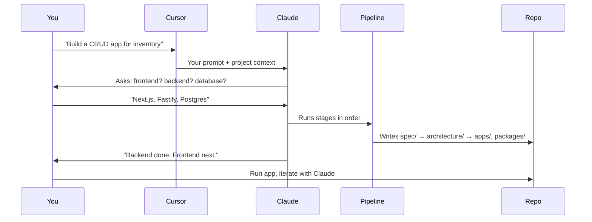
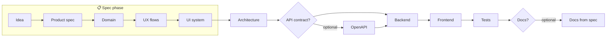
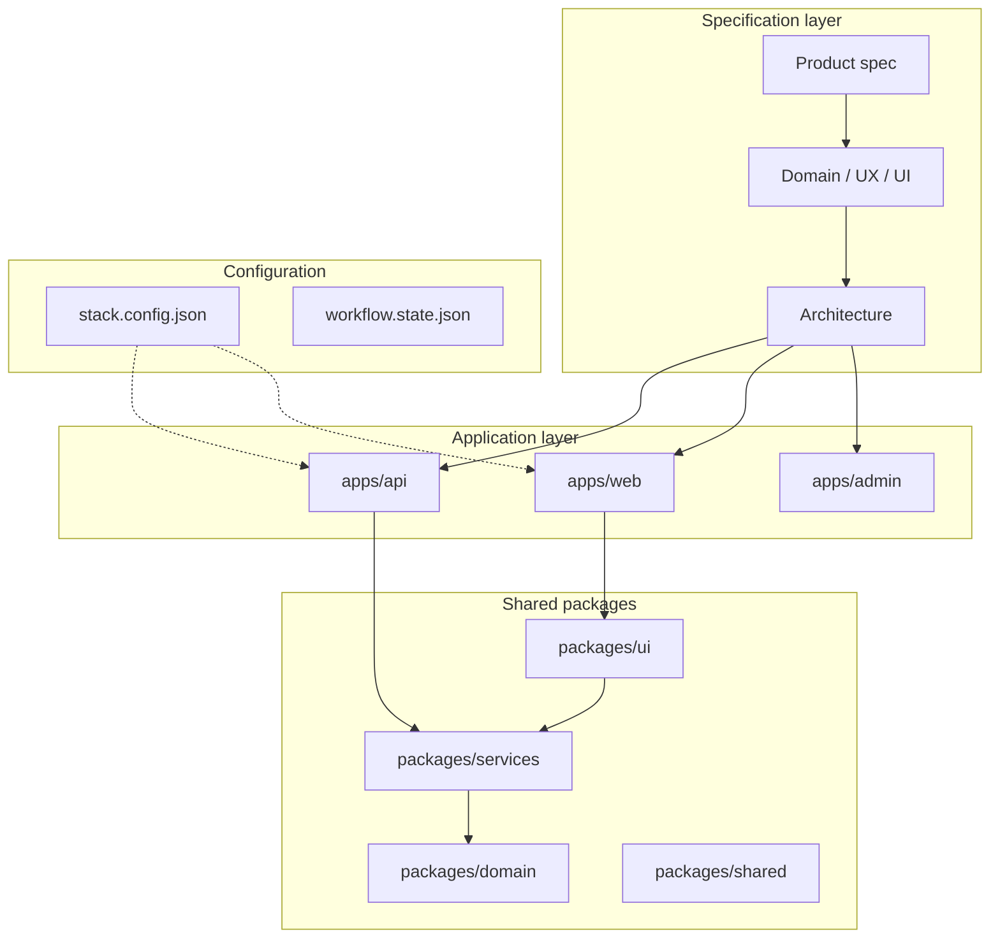
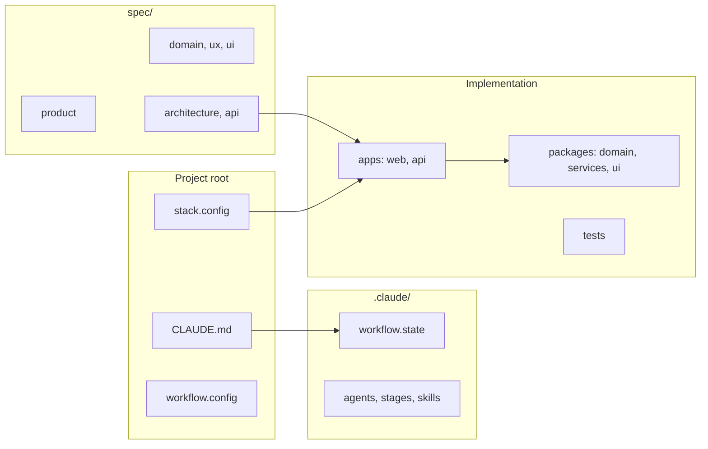

# Awesome Software Framework

**Build apps with Claude—specs first, code second.**  
Scaffold a repo where Claude follows a clear pipeline: idea → specs → architecture → backend → frontend → tests. No code before architecture. You describe what you want; Claude asks for your stack and builds it step by step.

[](https://github.com/lovek28/awesome-software-framework) · [](LICENSE)

### From idea to app (at a glance)



---

## Table of contents

- [From idea to app](#from-idea-to-app-at-a-glance)
- [Quick start](#-quick-start)
- [What you get](#-what-you-get)
- [When to use this](#-when-to-use-this)
- [When not to use this](#-when-not-to-use-this)
- [Use cases](#-use-cases)
- [How it works](#-how-it-works)
- [Pipeline flow (diagram)](#-pipeline-flow-diagram)
- [Architecture (diagram)](#-architecture-diagram)
- [Try these prompts](#-try-these-prompts)
- [Commands & options](#-commands--options)
- [Features at a glance](#-features-at-a-glance)
- [Project structure](#-project-structure)
- [Upgrading a project](#-upgrading-a-project)
- [License](#license)

---

## Quick start

**1. Create a new project** (no clone needed):

```bash
npx github:lovek28/awesome-software-framework myapp
```

**2. Go into the project and open it in your editor:**

```bash
cd myapp
```

Then open `myapp` in **Cursor** or **VS Code**.

**3. Tell Claude what to build.**

In the chat, say something like:

- *"Build a CRUD app for inventory"*
- *"Build a dashboard with login"*
- *"Build a marketplace for freelancers"*

Claude will ask you for tech choices (frontend, backend, database, etc.), write them to `stack.config.json`, and run the full pipeline: specs → architecture → backend → frontend → tests. You just answer and review.

---

## What you get

| You get … | How it helps |
|-----------|----------------|
| **A spec-first repo** | Product, domain, UX, and architecture are written before any app code. |
| **One place for stack** | `stack.config.json` stores your choices; Claude generates code to match. |
| **A clear pipeline** | Idea → product spec → domain → UX → UI → architecture → backend → frontend → tests (with optional API contract and docs). |
| **Presets for speed** | Say "CRUD app for X" or "dashboard with auth" and Claude can use a preset to move faster. |
| **Upgrade path** | Run `create-awesome-software upgrade` later to pull template updates without touching your specs or code. |

---

## When to use this

Use this framework when:

| Situation | Why it fits |
|-----------|-------------|
| **Greenfield web app or API** | You're starting from zero and want a clear path from idea to running code. |
| **You want specs before code** | You care about product spec, domain model, and architecture before implementation. |
| **You use Claude (Cursor, etc.)** | The pipeline is designed for AI-assisted development with a single, deterministic workflow. |
| **You like a fixed pipeline** | You're happy with idea → spec → domain → UX → architecture → backend → frontend → tests (with optional stages). |
| **CRUD, dashboard, API, or small product** | Presets and the default stack support these shapes well. |
| **Solo or small team** | One person (or a few) can drive the chat and own the repo; no heavy process. |
| **Learning SDLC or DDD** | The repo structure and stages teach spec-first, domain-driven, layered design. |
| **You want upgradeable template** | You're fine with `stack.config.json` and workflow state and want to pull framework updates later. |

---

## When not to use this

Avoid or adapt this framework when:

| Situation | Why it's a poor fit |
|-----------|----------------------|
| **Existing codebase with no specs** | The pipeline assumes you start from idea/spec. Migrating a large legacy app into this structure is a big refactor. |
| **You don't want a pipeline** | If you prefer free-form coding or a different lifecycle (e.g. TDD-only, no written spec), this workflow will feel rigid. |
| **Tiny one-off script or CLI** | Overkill for a single file or a 100-line script; no need for spec/domain/architecture layers. |
| **Non-Claude / no AI assistant** | The instructions (CLAUDE.md, workflow state) target Claude in Cursor; other tools won't follow the same flow without adaptation. |
| **Heavy existing process** | If you already have strict PM/design/architecture gates and tools, this pipeline may duplicate or conflict. |
| **Mobile-only with no web** | The template is web + API centric; mobile (e.g. Expo) is optional and less built-out. |
| **Need for a different stack layout** | Monorepo with apps/packages is fixed; if you need a different structure, you'll be customizing a lot. |

You can still clone the repo and use only the parts you like (e.g. just the spec layout or the workflow config).

---

## Use cases

Concrete ways people use this framework:

### By project type

| Project type | How you might use it | Preset / mode |
|--------------|----------------------|----------------|
| **CRUD / admin tool** | "Build an admin to manage X" → pick stack → get spec + API + UI. | `crud`, or describe the resource. |
| **Dashboard with auth** | "Build a dashboard with GitHub login" → auth + protected pages. | `auth-dashboard`. |
| **REST API only** | "Build an API for Y, no UI" → spec + architecture + OpenAPI + backend + tests. | `api-only`. |
| **Full-stack product (MVP)** | "Build a marketplace for Z" → full pipeline: spec, domain, UX, architecture, backend, frontend, tests. | Full mode; optional docs. |
| **Internal tool or portal** | "Build a tool for our team to do W" → same pipeline; add auth and deploy as needed. | Full or quick mode. |
| **Learning project** | "Build a blog / todo / booking app" to learn the stack and spec-first flow. | Any preset or full. |

### By goal

| Goal | What you do |
|------|-------------|
| **Ship an MVP fast** | Use quick mode or a preset; answer stack questions; let Claude run the pipeline. |
| **Keep a single source of truth** | Specs in `spec/`; code generated from them; change spec then ask Claude to update code. |
| **Align with stakeholders** | Share product spec and UX flows before implementation; iterate on spec, then regenerate. |
| **Standardize stack and stages** | Set stack once in `stack.config.json`; use the same pipeline across projects. |
| **Add an admin or mobile app later** | Start with web + API; add `frontend_admin` or `mobile` in stack and run frontend for the new app. |
| **Deploy to Vercel / Fly / Docker** | Set `deploy` in stack; use deploy_config stage and CI example to get config and docs. |

### By role

| Role | How you use it |
|------|----------------|
| **Founder / PM** | Describe the product; review product spec and UX; leave stack and implementation to Claude (or a dev). |
| **Developer** | Run the CLI; open in Cursor; answer stack and follow-up questions; review and refine generated code. |
| **Designer** | Provide flows and UI direction; Claude fills `spec/ux/` and `spec/ui/`; you review and iterate. |
| **Solo builder** | One person does idea → spec → stack → pipeline; use presets and quick mode to move fast. |

---

## How it works

1. **You describe the product** in plain language (e.g. "Build a task manager for teams").
2. **Claude asks for your stack** — frontend, backend, database, ORM, styling, auth, deploy target — and saves it in `stack.config.json`.
3. **Claude runs the pipeline in order:** writes specs (product, domain, UX, UI), then architecture, then implements backend and frontend, then tests. Optional stages (API contract, docs) and presets (CRUD, auth-dashboard, api-only) are available.
4. **Specs stay the source of truth.** Code is generated from them; you can change specs and ask Claude to update code.

---

## Pipeline flow (diagram)

Stages run in order. Optional stages (API contract, Docs) can be enabled in your workflow; Presets skip or merge some steps for speed.



**Linear view:**

```
Idea → Product spec → Domain → UX → UI → Architecture
  → [API contract?] → Backend → Frontend → Tests → [Docs?]
```

---

## Architecture (diagram)

Generated projects follow a **spec-first, layered** layout: specs drive architecture, which drives implementation. All apps share the same API and domain.



**Layers (top = user-facing, bottom = foundation):**

```
┌─────────────────────────────────────────────────────────┐
│  apps/web  (optional: apps/admin, apps/mobile)           │  ← Frontend
├─────────────────────────────────────────────────────────┤
│  packages/ui                                            │  ← Shared UI
├─────────────────────────────────────────────────────────┤
│  apps/api                                               │  ← HTTP API
├─────────────────────────────────────────────────────────┤
│  packages/services  (use cases)                         │  ← Application logic
├─────────────────────────────────────────────────────────┤
│  packages/domain  (entities, rules)                     │  ← Domain model
├─────────────────────────────────────────────────────────┤
│  spec/  (product, domain, ux, ui, architecture)          │  ← Source of truth
└─────────────────────────────────────────────────────────┘
```

---

## Try these prompts

Once your project is open in Cursor/VS Code, you can say:

| Goal | Example prompt |
|------|-----------------|
| Start from scratch | *"Build a CRUD app for managing projects"* |
| Auth + dashboard | *"Build a dashboard with GitHub login"* |
| API only | *"Build a REST API for a booking system, no UI"* |
| Custom stack | *"Build a blog with Next.js, Prisma, and Tailwind"* |

Claude will ask follow-up questions if needed and then run the pipeline.

---

## Commands & options

| Command | Description |
|--------|-------------|
| `npx github:lovek28/awesome-software-framework <name>` | Create a new project (no clone). |
| `node cli.js <name>` | Create a new project (from a clone of this repo). |
| `create-awesome-software upgrade [path]` | Update an existing project with the latest template files (CLAUDE, workflow, agents, docker, .env.example). Your specs, code, and workflow state are not changed. Default path: current directory. |

| Option | Description |
|--------|-------------|
| `-v` / `--version` | Print the CLI version. |
| `-o` / `--output-dir <path>` | Create the project in this directory (default: current directory). |

Tip: the CLI may show *"Update available: x.y.z"* if a newer version exists. Set `NO_UPDATE_CHECK=1` to disable the check.

---

## Features at a glance

- **Workflow** — Optional/custom stages, quality gates, quick vs full mode, checkpoints and resume.
- **Auth & security** — Optional auth in stack; security checklist in `spec/security.md`; secrets only in env.
- **Deploy & CI** — Optional deploy target (Vercel, Docker, Fly, Railway); CI workflow example; env matrix.
- **API contract** — Optional OpenAPI spec; backend and frontend stay in sync.
- **Tests** — Test runner and E2E setup; optional coverage; tests derived from specs.
- **Observability** — Health endpoint, structured logging, optional runbooks and ADRs.
- **Multi-app & presets** — Optional admin or mobile app; presets for CRUD, auth-dashboard, api-only.
- **Extensibility** — Hooks (before/after stage), custom stages.
- **Docs from spec** — Optional docs stage; API and product/UX docs generated from spec.
- **Agents & skills** — Per-stage instructions and Cursor agents (Spec, Backend, Frontend); stack and stage skills for consistent patterns.
- **Token control** — Per-stage context scope and optional summarization to keep usage predictable.

---

## Project structure

After you run the CLI, your project looks like this:

```
myapp/
├── CLAUDE.md                 # Main instructions for Claude
├── stack.config.json         # Your tech stack
├── workflow.config.json      # Pipeline stages, optional ones, hooks
├── .claude/
│   ├── workflow.state.json  # Current stage, idea, completed list, mode
│   ├── instructions.md      # Workflow rules
│   ├── agents.md            # Spec / Backend / Frontend agents
│   ├── context-scope.md     # What to read per stage
│   ├── stages/              # Per-stage instructions
│   └── skills/              # Stack & stage skills (e.g. Next.js, Prisma)
├── spec/
│   ├── product/, domain/, ux/, ui/, architecture/
│   ├── security.md
│   └── api/openapi.yaml     # When using API contract
├── .presets/                # CRUD, auth-dashboard, api-only
├── apps/                    # web, api; optionally admin, mobile
├── packages/                # domain, services, ui, shared
├── tests/                   # unit, integration, e2e
├── docs/                    # Generated from spec (optional)
└── infra/                   # DB, deploy, CI
```

**Visual overview:**



The most important files to know: **CLAUDE.md** (how Claude works), **.claude/workflow.state.json** (current stage), and **stack.config.json** (your choices).

---

## Upgrading a project

If you created the project with an older version of the framework, you can pull the latest template updates without overwriting your work:

```bash
cd myapp
npx github:lovek28/awesome-software-framework upgrade
```

This updates CLAUDE.md, workflow config, .claude instructions/agents/context-scope/extensibility, docker-compose, and .env.example. Your **specs**, **code**, **stack.config.json**, and **workflow state** are left as-is. Your project’s README also explains this.

---

## License

MIT · [Repository](https://github.com/lovek28/awesome-software-framework)
